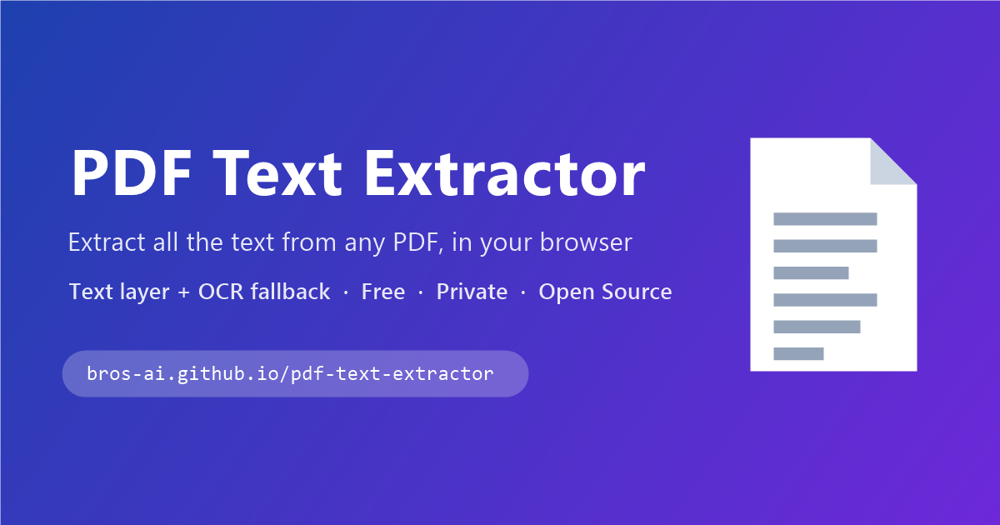

# 📄 PDF Text Extractor



**[▶ Live demo — bros-ai.github.io/pdf-text-extractor](https://bros-ai.github.io/pdf-text-extractor/)**


A single-file, zero-install web app that extracts **all text** from PDFs — entirely in your browser. Drag & drop a PDF and get its text instantly, with automatic OCR for scanned pages.

## ✨ Features

- **Hybrid extraction (best of both worlds)**
  - Native **text layer** read with [pdf.js](https://mozilla.github.io/pdf.js/) — instant and lossless for digital PDFs, with layout-aware line reconstruction
  - Automatic **OCR fallback** with [Tesseract.js](https://tesseract.projectnaptha.com/) — scanned pages are rendered at high resolution (~2400 px) and recognized, with a per-page confidence score
- **Drag & drop** anywhere, click to browse, or paste a PDF with `Ctrl+V` — multi-file supported
- **Modes**: Auto (hybrid) · Text layer only (fast) · Force OCR
- **OCR languages**: English, Français, Español, Deutsch, Italiano, Português
- Per-page collapsible results with source badges (`text layer` / `OCR n%` / `no text`) and per-page copy
- **Search** the extracted text with live highlighting and match counts
- Processing modal with **live page preview + animated scan line** during OCR, progress, ETA and cancel
- **Export**: copy all, download `.txt` or `.md` (with page headings)
- **Share modal**: native share sheet, X/Twitter, LinkedIn, WhatsApp, Facebook, email
- **Offline-capable PWA**: installable, service worker caches the app and libraries after first visit
- OCR engine is lazy-loaded — the ~2 MB Tesseract library is only fetched if a page actually needs OCR
- Dark/light theme follows your system · keyboard accessible · respects `prefers-reduced-motion`

## 🔒 Privacy

Your files **never leave your device**. All parsing and OCR run locally in the browser — no upload, no server, no tracking. Internet is only needed on first load to fetch the pdf.js/Tesseract libraries and OCR language data from CDN (cached afterwards).

## 🚀 Usage

**Online:** open the [live demo](https://bros-ai.github.io/pdf-text-extractor/).

**Locally:** clone the repo and open `index.html` in any modern browser — that's it. No build step, no dependencies to install.

```bash
git clone https://github.com/Bros-AI/pdf-text-extractor.git
start pdf-text-extractor/index.html   # Windows (or just double-click it)
```

## 🛠 How it works

1. The PDF is opened with **pdf.js** and each page's embedded text layer is extracted, reconstructing line breaks from glyph positions.
2. In Auto mode, any page yielding fewer than ~30 characters is considered a scan: it's rendered to a canvas scaled to ~2400 px on its longest side, then recognized by a reusable **Tesseract.js** worker in the selected language(s).
3. Whichever result is richer wins, and the page is tagged with its source (and OCR confidence when applicable).

## 📄 License

[MIT](LICENSE) — © [Bros.AI](https://bros.ai)
